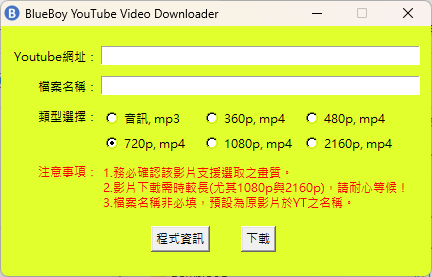
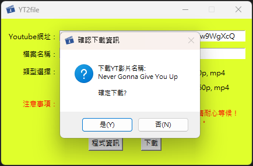
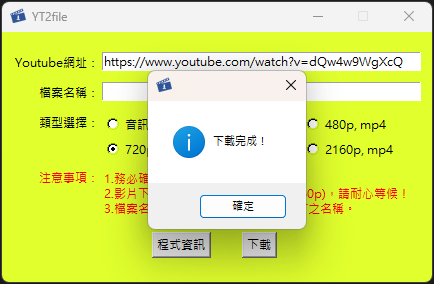
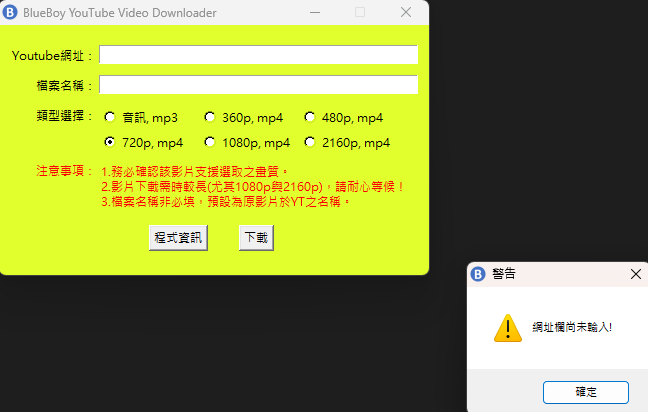

# YT2file
繁體中文 | [English](./README_en.md)

一款能以高品質下載YouTube影片的開源免安裝軟體。

## 動機
網路上雖有許多的YouTube影片下載網站或APP能用，然而有的暗藏病毒，有的廣告很多，有的則要付費才能下載高畫質影片，基於生活中遇到的不便，將「自製YouTube影片下載器」作為110學年度第二學期的自主學習內容。本軟體則為該次自主學習成果之改良。

## 使用套件
* [pytube](https://pytube.io/) - v15.0.0
* [MoviePy](https://zulko.github.io/moviepy/) - v1.0.3

## 截圖
* 主視窗 

* 下載前影片資訊確認 

* 下載完成 

* 網址未輸入警告 

